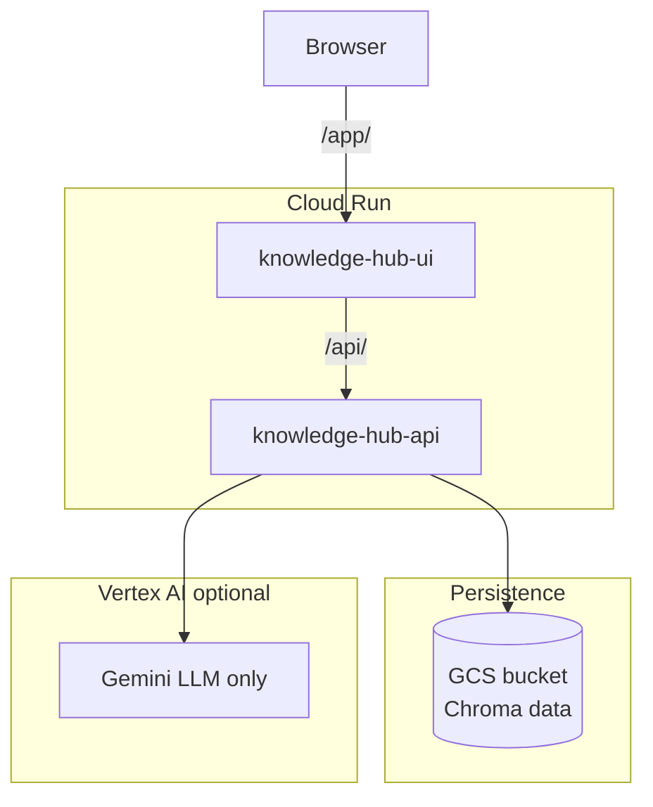

# Deploying Knowledge HUB to Google Cloud Platform

Docker-first deployment: build two images (backend + frontend), push to **Artifact Registry**, deploy both to **Cloud Run**.

**RAG mode for this guide:** `USE_LOCAL_RAG=1` — Chroma on disk (no Vertex RAG Engine). The LLM can still use **Gemini via Vertex** when `GOOGLE_GENAI_USE_VERTEXAI=True`.

For local development and Vertex RAG troubleshooting, see [README.md](README.md).

---

## Deployment model: two Cloud Run services

| Service | Cloud Run name (example) | Image | What runs inside |
|---------|--------------------------|-------|------------------|
| **Backend** | `knowledge-hub-api` | `Dockerfile.backend` | ADK API server, Chroma RAG, optional Vertex Gemini |
| **Frontend** | `knowledge-hub-ui` | `frontend/Dockerfile` | nginx + React static files + `/api` proxy |



Repo Docker assets:

| File | Purpose |
|------|---------|
| [`Dockerfile.backend`](Dockerfile.backend) | Python 3.11, `adk api_server`, agent + seed assets |
| [`frontend/Dockerfile`](frontend/Dockerfile) | Multi-stage Node build + nginx |
| [`frontend/nginx.conf.template`](frontend/nginx.conf.template) | `/api` proxy (filled at container start) |
| [`frontend/entrypoint.sh`](frontend/entrypoint.sh) | Substitutes `API_UPSTREAM_HOST` into nginx config |
| [`.dockerignore`](.dockerignore) | Keeps images small |
| [`docker-compose.yml`](docker-compose.yml) | Local run: both services + HTTP `/api` proxy |
| [`.env.docker.example`](.env.docker.example) | Template env file for Compose |

---

## Run locally with Docker Compose

The deployment plan focused on **Cloud Run**; Compose is for **local parity** (same images, same two-service split).

```bash
cp .env.docker.example .env.docker
# Set GOOGLE_CLOUD_PROJECT, GOOGLE_CLOUD_LOCATION, USE_LOCAL_RAG=1

docker compose up --build
```

| URL | Notes |
|-----|--------|
| http://localhost:8081/app/ | Frontend (nginx → `http://api:8080`) |
| http://localhost:8080/docs | Backend API |

Frontend uses `API_UPSTREAM_SCHEME=http` and `API_UPSTREAM_HOST=api:8080`. On Cloud Run, set `API_UPSTREAM_SCHEME=https` (default) and the `*.a.run.app` host.

Seed corpus:

```bash
docker compose run --rm api python scripts/seed_aegis_demo.py
```

---

## What is Cloud Run?

[Cloud Run](https://cloud.google.com/run) runs your **container images** as HTTPS services. You build and push images; Google handles scaling, TLS, and routing. You pay mainly while requests are being served.

This project uses Cloud Run for **both** tiers so you have one deployment model, shared region/project, and independent scaling for API vs static UI.

---

## Environment variables

Set these on the **backend** Cloud Run service. Do not bake secrets into images; use `--set-env-vars` or Secret Manager.

### Backend (`knowledge-hub-api`)

| Variable | Required | Default / example | Description |
|----------|----------|-------------------|-------------|
| `USE_LOCAL_RAG` | **Yes** | `1` | Use Chroma; skip Vertex RAG Engine APIs |
| `LOCAL_RAG_DATA_DIR` | **Yes** | `/data/local_rag` | Must match volume mount path when using GCS persistence |
| `GOOGLE_CLOUD_PROJECT` | If Vertex LLM | `your-project-id` | GCP project (Vertex init skipped for RAG when local RAG is on, but LLM may still need it) |
| `GOOGLE_CLOUD_LOCATION` | If Vertex LLM | `us-central1` | Region for Gemini via Vertex |
| `GOOGLE_GENAI_USE_VERTEXAI` | Recommended | `True` | Route Gemini through Vertex (not AI Studio API key) |
| `PORT` | No | `8080` | Set by Cloud Run automatically |

**Local RAG only (no Vertex LLM):** set `USE_LOCAL_RAG=1` and omit or leave empty `GOOGLE_CLOUD_PROJECT` / `GOOGLE_GENAI_USE_VERTEXAI` if you switch the agent to a non-Vertex model later.

**With Vertex Gemini + local RAG:** set all of `USE_LOCAL_RAG=1`, `GOOGLE_CLOUD_PROJECT`, `GOOGLE_CLOUD_LOCATION`, `GOOGLE_GENAI_USE_VERTEXAI=True`.

### Frontend (`knowledge-hub-ui`)

| Variable | Required | Default | Description |
|----------|----------|---------|-------------|
| `API_UPSTREAM_HOST` | **Yes** | — | Backend host (and port for local), e.g. `knowledge-hub-api-xxxxx-uc.a.run.app` or `api:8080` |
| `API_UPSTREAM_SCHEME` | No | `https` | `https` for Cloud Run; `http` for Docker Compose |
| `PORT` | No | `8080` | Cloud Run sets this |

### Build-time (your shell, not Cloud Run)

| Variable | Example | Description |
|----------|---------|-------------|
| `GOOGLE_CLOUD_PROJECT` | `my-project` | GCP project ID |
| `GOOGLE_CLOUD_LOCATION` | `us-central1` | Region for Cloud Run and Artifact Registry |
| `AR_REPO` | `knowledge-hub` | Artifact Registry repository name |
| `IMAGE_TAG` | `v1` or `$(git rev-parse --short HEAD)` | Image tag for both services |

---

## Prerequisites

1. Google Cloud project with [billing enabled](https://cloud.google.com/billing/docs/how-to/modify-project).
2. [gcloud CLI](https://cloud.google.com/sdk/docs/install), [Docker](https://docs.docker.com/get-docker/).
3. Local tools for seeding (optional): `uv sync` or `pip install -r requirements.txt`.

```bash
gcloud auth login
gcloud auth application-default login
gcloud auth configure-docker ${GOOGLE_CLOUD_LOCATION}-docker.pkg.dev
```

---

## One-time GCP setup

Run from repo root. Replace placeholders.

### 0. Export deployment variables

```bash
export GOOGLE_CLOUD_PROJECT=YOUR_PROJECT_ID
export GOOGLE_CLOUD_LOCATION=us-central1
export AR_REPO=knowledge-hub
export IMAGE_TAG=v1
export RUN_SA=knowledge-hub-runner@${GOOGLE_CLOUD_PROJECT}.iam.gserviceaccount.com
export RAG_BUCKET=${GOOGLE_CLOUD_PROJECT}-knowledge-hub-rag
export API_SERVICE=knowledge-hub-api
export UI_SERVICE=knowledge-hub-ui
export LOCAL_RAG_MOUNT=/data/local_rag

export AR_HOST=${GOOGLE_CLOUD_LOCATION}-docker.pkg.dev
export AR_IMAGE_PREFIX=${AR_HOST}/${GOOGLE_CLOUD_PROJECT}/${AR_REPO}
```

### 1. Enable APIs

```bash
gcloud config set project $GOOGLE_CLOUD_PROJECT

gcloud services enable \
  run.googleapis.com \
  artifactregistry.googleapis.com \
  storage.googleapis.com \
  aiplatform.googleapis.com \
  --project=$GOOGLE_CLOUD_PROJECT
```

(`aiplatform.googleapis.com` only needed if using **Vertex for Gemini**.)

### 2. Artifact Registry

```bash
gcloud artifacts repositories create $AR_REPO \
  --repository-format=docker \
  --location=$GOOGLE_CLOUD_LOCATION \
  --project=$GOOGLE_CLOUD_PROJECT \
  --description="Knowledge HUB images" \
  2>/dev/null || true
```

### 3. Runtime service account

```bash
gcloud iam service-accounts create knowledge-hub-runner \
  --display-name="Knowledge HUB Cloud Run" \
  --project=$GOOGLE_CLOUD_PROJECT \
  2>/dev/null || true

# Vertex Gemini (optional; skip if not using GOOGLE_GENAI_USE_VERTEXAI)
gcloud projects add-iam-policy-binding $GOOGLE_CLOUD_PROJECT \
  --member="serviceAccount:${RUN_SA}" \
  --role="roles/aiplatform.user"
```

### 4. GCS bucket for Chroma persistence

Cloud Run disk is ephemeral. Mount a bucket so `LOCAL_RAG_DATA_DIR` survives restarts.

```bash
gcloud storage buckets create gs://${RAG_BUCKET} \
  --project=$GOOGLE_CLOUD_PROJECT \
  --location=$GOOGLE_CLOUD_LOCATION \
  --uniform-bucket-level-access \
  2>/dev/null || true

gcloud storage buckets add-iam-policy-binding gs://${RAG_BUCKET} \
  --member="serviceAccount:${RUN_SA}" \
  --role="roles/storage.objectAdmin" \
  --project=$GOOGLE_CLOUD_PROJECT
```

---

## Build and push Docker images

From **repository root**.

**Apple Silicon (M1/M2/M3):** Cloud Run requires `linux/amd64`. Add `--platform linux/amd64` to every `docker build` (shown below).

```bash
cd /path/to/adk-rag-agent

# Backend
docker build --platform linux/amd64 -f Dockerfile.backend -t ${AR_IMAGE_PREFIX}/${API_SERVICE}:${IMAGE_TAG} .

docker push ${AR_IMAGE_PREFIX}/${API_SERVICE}:${IMAGE_TAG}

# Frontend (context = repo root; Dockerfile under frontend/)
docker build --platform linux/amd64 -f frontend/Dockerfile -t ${AR_IMAGE_PREFIX}/${UI_SERVICE}:${IMAGE_TAG} .

docker push ${AR_IMAGE_PREFIX}/${UI_SERVICE}:${IMAGE_TAG}
```

The backend image uses [`scripts/run_api_server.py`](scripts/run_api_server.py) (no `reload`) instead of `adk api_server`, which fails on Cloud Run. Container user UID **1000** matches the GCS FUSE mount.

---

## Deploy backend (local RAG + optional Vertex LLM)

### First deploy

```bash
gcloud run deploy $API_SERVICE \
  --image=${AR_IMAGE_PREFIX}/${API_SERVICE}:${IMAGE_TAG} \
  --region=$GOOGLE_CLOUD_LOCATION \
  --project=$GOOGLE_CLOUD_PROJECT \
  --service-account=$RUN_SA \
  --port=8080 \
  --allow-unauthenticated \
  --memory=2Gi \
  --cpu=2 \
  --timeout=300 \
  --min-instances=0 \
  --max-instances=5 \
  --add-volume=name=rag-data,type=cloud-storage,bucket=${RAG_BUCKET} \
  --add-volume-mount=volume=rag-data,mount-path=${LOCAL_RAG_MOUNT} \
  --set-env-vars="USE_LOCAL_RAG=1,LOCAL_RAG_DATA_DIR=${LOCAL_RAG_MOUNT},GOOGLE_CLOUD_PROJECT=${GOOGLE_CLOUD_PROJECT},GOOGLE_CLOUD_LOCATION=${GOOGLE_CLOUD_LOCATION},GOOGLE_GENAI_USE_VERTEXAI=True"
```

Save the URL:

```bash
export API_URL=$(gcloud run services describe $API_SERVICE \
  --region=$GOOGLE_CLOUD_LOCATION \
  --project=$GOOGLE_CLOUD_PROJECT \
  --format='value(status.url)')
echo $API_URL
```

Extract host for the frontend (no scheme):

```bash
export API_UPSTREAM_HOST=$(echo "$API_URL" | sed -e 's|https://||' -e 's|http://||')
echo $API_UPSTREAM_HOST
```

### Seed the Aegis demo corpus (one-time per bucket)

Run locally with the same `LOCAL_RAG_DATA_DIR` you use in prod, **or** exec into a Cloud Run job. Easiest: seed locally then sync to GCS, or run once from a machine with ADC:

**Option A — seed locally, upload to bucket**

```bash
export USE_LOCAL_RAG=1
export LOCAL_RAG_DATA_DIR=./data/local_rag
uv run python scripts/seed_aegis_demo.py
gcloud storage rsync -r ./data/local_rag gs://${RAG_BUCKET}/ --delete-unmatched-destination-objects=false
```

**Option B — Cloud Run Job (same image as API)**

```bash
gcloud run jobs create knowledge-hub-seed \
  --image=${AR_IMAGE_PREFIX}/${API_SERVICE}:${IMAGE_TAG} \
  --region=$GOOGLE_CLOUD_LOCATION \
  --project=$GOOGLE_CLOUD_PROJECT \
  --service-account=$RUN_SA \
  --add-volume=name=rag-data,type=cloud-storage,bucket=${RAG_BUCKET} \
  --add-volume-mount=volume=rag-data,mount-path=${LOCAL_RAG_MOUNT} \
  --set-env-vars="USE_LOCAL_RAG=1,LOCAL_RAG_DATA_DIR=${LOCAL_RAG_MOUNT}" \
  --command=python \
  --args=scripts/seed_aegis_demo.py \
  --max-retries=0 \
  --task-timeout=600 \
  2>/dev/null || true

gcloud run jobs execute knowledge-hub-seed \
  --region=$GOOGLE_CLOUD_LOCATION \
  --project=$GOOGLE_CLOUD_PROJECT \
  --wait
```

Verify via API after seeding:

```bash
curl -s -X POST "$API_URL/run" \
  -H "Content-Type: application/json" \
  -d '{
    "app_name": "knowledge_hub",
    "user_id": "u_999",
    "session_id": "deploy-test-1",
    "new_message": {"role": "user", "parts": [{"text": "list corpora"}]}
  }' | head -c 2000
```

---

## Deploy frontend

```bash
gcloud run deploy $UI_SERVICE \
  --image=${AR_IMAGE_PREFIX}/${UI_SERVICE}:${IMAGE_TAG} \
  --region=$GOOGLE_CLOUD_LOCATION \
  --project=$GOOGLE_CLOUD_PROJECT \
  --port=8080 \
  --allow-unauthenticated \
  --memory=512Mi \
  --cpu=1 \
  --timeout=300 \
  --set-env-vars="API_UPSTREAM_HOST=${API_UPSTREAM_HOST},API_UPSTREAM_SCHEME=https"

export UI_URL=$(gcloud run services describe $UI_SERVICE \
  --region=$GOOGLE_CLOUD_LOCATION \
  --project=$GOOGLE_CLOUD_PROJECT \
  --format='value(status.url)')
echo "Open: ${UI_URL}/app/"
```

---

## Manual command checklist (copy-paste order)

| Step | Command section |
|------|-----------------|
| 1 | [Export deployment variables](#0-export-deployment-variables) |
| 2 | [Enable APIs](#1-enable-apis) |
| 3 | [Artifact Registry](#2-artifact-registry) |
| 4 | [Service account](#3-runtime-service-account) |
| 5 | [GCS bucket](#4-gcs-bucket-for-chroma-persistence) |
| 6 | [Build and push images](#build-and-push-docker-images) |
| 7 | [Deploy backend](#deploy-backend-local-rag--optional-vertex-llm) |
| 8 | [Seed corpus](#seed-the-aegis-demo-corpus-one-time-per-bucket) |
| 9 | [Deploy frontend](#deploy-frontend) |
| 10 | [Test deployment](#test-the-deployment) |

---

## Test the deployment

### API

```bash
curl -s "$API_URL/list-apps" | jq .

curl -s -X POST "$API_URL/apps/knowledge_hub/users/u_999/sessions/test-session-1" \
  -H "Content-Type: application/json"

curl -s -X POST "$API_URL/run_sse" \
  -H "Content-Type: application/json" \
  -d '{
    "app_name": "knowledge_hub",
    "user_id": "u_999",
    "session_id": "test-session-1",
    "new_message": {
      "role": "user",
      "parts": [{"text": "Does our code validate line clearance before production?"}]
    },
    "streaming": true
  }'
```

If services are private:

```bash
export TOKEN=$(gcloud auth print-identity-token)
curl -s -H "Authorization: Bearer $TOKEN" "$API_URL/list-apps"
```

### UI

1. Open `https://<ui-service>/app/`.
2. Confirm backend health (app calls `/api/docs`).
3. Run golden demo questions from [README.md](README.md#golden-demo-questions).

### Logs

```bash
gcloud run services logs read $API_SERVICE \
  --region=$GOOGLE_CLOUD_LOCATION \
  --project=$GOOGLE_CLOUD_PROJECT \
  --limit=50

gcloud run services logs read $UI_SERVICE \
  --region=$GOOGLE_CLOUD_LOCATION \
  --project=$GOOGLE_CLOUD_PROJECT \
  --limit=50
```

---

## Update a release (new image tag)

```bash
export IMAGE_TAG=v2

# Rebuild, push (same as [Build and push](#build-and-push-docker-images))
docker build -f Dockerfile.backend -t ${AR_IMAGE_PREFIX}/${API_SERVICE}:${IMAGE_TAG} .
docker push ${AR_IMAGE_PREFIX}/${API_SERVICE}:${IMAGE_TAG}
docker build -f frontend/Dockerfile -t ${AR_IMAGE_PREFIX}/${UI_SERVICE}:${IMAGE_TAG} .
docker push ${AR_IMAGE_PREFIX}/${UI_SERVICE}:${IMAGE_TAG}

gcloud run deploy $API_SERVICE \
  --image=${AR_IMAGE_PREFIX}/${API_SERVICE}:${IMAGE_TAG} \
  --region=$GOOGLE_CLOUD_LOCATION \
  --project=$GOOGLE_CLOUD_PROJECT

gcloud run deploy $UI_SERVICE \
  --image=${AR_IMAGE_PREFIX}/${UI_SERVICE}:${IMAGE_TAG} \
  --region=$GOOGLE_CLOUD_LOCATION \
  --project=$GOOGLE_CLOUD_PROJECT
```

---

## Rollback

List revisions:

```bash
gcloud run revisions list --service=$API_SERVICE \
  --region=$GOOGLE_CLOUD_LOCATION --project=$GOOGLE_CLOUD_PROJECT
```

Route 100% traffic to a previous revision:

```bash
gcloud run services update-traffic $API_SERVICE \
  --to-revisions=REVISION_NAME=100 \
  --region=$GOOGLE_CLOUD_LOCATION \
  --project=$GOOGLE_CLOUD_PROJECT
```

Or redeploy a known-good image tag:

```bash
export IMAGE_TAG=v1
gcloud run deploy $API_SERVICE --image=${AR_IMAGE_PREFIX}/${API_SERVICE}:${IMAGE_TAG} ...
```

---

## Production checklist

- [ ] `USE_LOCAL_RAG=1` and `LOCAL_RAG_DATA_DIR` match GCS volume mount
- [ ] GCS bucket seeded (`aegis-demo` corpus)
- [ ] `API_UPSTREAM_HOST` on UI service matches current backend host
- [ ] Backend app name remains `knowledge_hub` (matches [frontend/src/App.tsx](frontend/src/App.tsx))
- [ ] Vertex API + billing if using `GOOGLE_GENAI_USE_VERTEXAI=True`
- [ ] Runtime SA has `roles/aiplatform.user` (LLM) and `storage.objectAdmin` on RAG bucket
- [ ] Request timeout ≥ 300s on API service
- [ ] Restrict `--allow-unauthenticated` for non-demo environments

---

## Troubleshooting

| Symptom | What to check |
|---------|----------------|
| Empty RAG / no corpora | Seed script; GCS mount; `LOCAL_RAG_DATA_DIR` path |
| Corpora lost after restart | Volume not mounted; wrong bucket or IAM |
| UI “backend not ready” | `API_UPSTREAM_HOST` (host only); backend URL reachable |
| `403` on Gemini | Billing, `GOOGLE_GENAI_USE_VERTEXAI`, SA `aiplatform.user` |
| `API_UPSTREAM_HOST is required` | Set env on UI deploy |
| Large backend image build | `.dockerignore`; chromadb first run downloads ONNX model |
| `app_name` mismatch | API must expose `knowledge_hub` |

---

## Alternative: `adk deploy cloud_run`

ADK can build and deploy the agent without your `Dockerfile.backend`:

```bash
cp requirements.txt knowledge_hub/requirements.txt
uv run adk deploy cloud_run \
  --project=$GOOGLE_CLOUD_PROJECT \
  --region=$GOOGLE_CLOUD_LOCATION \
  --service_name=$API_SERVICE \
  --app_name=knowledge_hub \
  --port=8080 \
  knowledge_hub
```

You still need a **separate frontend image** and must configure `USE_LOCAL_RAG=1` and GCS volume via gcloud flags after `--`. This repo’s **Docker-first** path above is the source of truth for both services.

---

## Tear down

```bash
gcloud run services delete $API_SERVICE $UI_SERVICE \
  --region=$GOOGLE_CLOUD_LOCATION \
  --project=$GOOGLE_CLOUD_PROJECT \
  --quiet

gcloud storage rm -r gs://${RAG_BUCKET} --quiet  # optional

gcloud artifacts docker images delete \
  ${AR_IMAGE_PREFIX}/${API_SERVICE}:${IMAGE_TAG} --quiet  # optional
```

---

## References

- [Cloud Run volumes (Cloud Storage)](https://cloud.google.com/run/docs/configuring/services/cloud-storage-volume-mounts)
- [ADK — Deploy to Cloud Run](https://adk.dev/deploy/cloud-run/)
- [Knowledge HUB README](README.md)
