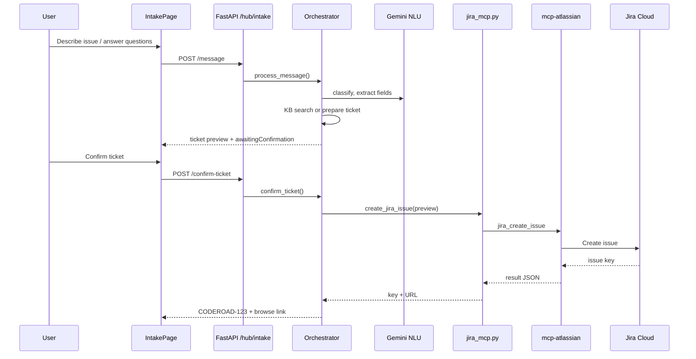

# Jira Integration — Support Intake Assistant

This document describes how the **Support Intake Assistant** creates Jira issues from structured support conversations. It covers architecture, configuration, API contracts, field mapping, deployment, and troubleshooting.

The integration is part of the `support_intake` package and is **not** used by the legacy Knowledge Hub Oracle chat (`knowledge_hub/agent.py`).

---

## Overview

The Support Intake Assistant is a **controlled workflow**, not a free-form chatbot. After collecting context through follow-up questions (and optionally attempting a Knowledge Hub answer), the orchestrator builds a **ticket preview**. The user must confirm before any Jira issue is created.

Jira connectivity uses two layers:

1. **Primary:** [`mcp-atlassian`](https://pypi.org/project/mcp-atlassian/) via MCP stdio (`uvx mcp-atlassian`), calling the `jira_create_issue` tool.
2. **Fallback:** Jira Cloud REST API v3 (`POST /rest/api/3/issue`) when the MCP subprocess fails.

Implementation lives in [`support_intake/adapters/jira_mcp.py`](support_intake/adapters/jira_mcp.py).

---

## Architecture



### Key files

| File | Role |
|------|------|
| [`support_intake/adapters/jira_mcp.py`](support_intake/adapters/jira_mcp.py) | MCP + REST issue creation, ticket preview builder |
| [`support_intake/orchestrator/machine.py`](support_intake/orchestrator/machine.py) | When to preview vs create; `confirm_ticket()` |
| [`support_intake/orchestrator/state.py`](support_intake/orchestrator/state.py) | `TicketPreview`, `jiraIssueKey`, `jiraIssueUrl` |
| [`support_intake/config/intake_rules.yaml`](support_intake/config/intake_rules.yaml) | Issue type defaults and labels per request type |
| [`support_intake/config.py`](support_intake/config.py) | `get_jira_settings()` — runtime env reads |
| [`support_intake/api.py`](support_intake/api.py) | `POST /hub/intake/confirm-ticket` |
| [`frontend/src/pages/IntakePage.tsx`](frontend/src/pages/IntakePage.tsx) | Ticket preview UI + confirm/cancel |
| [`frontend/src/components/TicketPreviewCard.tsx`](frontend/src/components/TicketPreviewCard.tsx) | Preview card |
| [`frontend/src/components/JiraCreatedBanner.tsx`](frontend/src/components/JiraCreatedBanner.tsx) | Post-create issue link |

---

## When a Jira ticket is created

Tickets are **never** created automatically without user confirmation.

### Paths that lead to ticket preview

| Trigger | Condition |
|---------|-----------|
| KB miss | No confident Knowledge Hub match after required fields collected |
| KB solution rejected | User answers **No** after a proposed KB solution |
| Always-ticket types | `feature_request`, `access_request`, `unsupported` (`always_create_ticket: true` in YAML) |
| Explicit request | User asks to create a ticket during conversation |
| Max follow-ups reached | Required fields still missing after `max_follow_up_questions` (default 8) |

### Paths that do **not** create a ticket

| Outcome | Condition |
|---------|-----------|
| Resolved via KB | User confirms the KB solution worked (`solutionAccepted: true`, status `closed`) |
| FAQ / known issue answered | High-confidence KB hit + user confirms resolution |
| User cancels preview | `POST /confirm-ticket` with `confirmed: false` |

---

## Workflow states (Jira-related)

```
… → PREPARING_TICKET → AWAITING_TICKET_CONFIRMATION → CREATING_TICKET → COMPLETE
                              ↑                              │
                              └──────── cancel / revise ─────┘
```

| Status | Meaning |
|--------|---------|
| `awaiting_ticket_confirmation` | Preview shown; waiting for user yes/no |
| `creating_ticket` | Jira API/MCP call in progress |
| `complete` | Issue created; `jiraIssueKey` and `jiraIssueUrl` set |

---

## Fixed issue mode (update instead of create)

Set `JIRA_FIXED_ISSUE_KEY` to update an existing issue instead of creating a new one:

```bash
JIRA_FIXED_ISSUE_KEY=AITR-89
```

When set, `submit_jira_ticket()` calls `jira_update_issue` (MCP) or `PUT /rest/api/3/issue/{key}` (REST fallback) with the intake summary and description. Leave empty to create new issues as before.


Add these to [`knowledge_hub/.env`](knowledge_hub/.env) (the file the API server loads). Templates are in [`.env.sample`](.env.sample) and [`knowledge_hub/.env.example`](knowledge_hub/.env.example).

| Variable | Required | Description |
|----------|----------|-------------|
| `JIRA_URL` | Yes | Jira Cloud base URL, e.g. `https://your-org.atlassian.net` |
| `JIRA_USERNAME` | Yes | Atlassian account email |
| `JIRA_API_TOKEN` | Yes | API token from [Atlassian account settings](https://id.atlassian.com/manage-profile/security/api-tokens) |
| `JIRA_PROJECT_KEY` | Yes | Target project key, e.g. `CODEROAD` |
| `JIRA_FIXED_ISSUE_KEY` | No | When set (e.g. `AITR-89`), update this issue instead of creating a new one |
| `READ_ONLY_MODE` | No | Must be `false` to allow issue creation (MCP server setting) |
| `UVX_COMMAND` | No | Path to `uvx` binary (default: `uvx`) |

Example:

```bash
JIRA_URL=https://coderoad.atlassian.net
JIRA_USERNAME=you@example.com
JIRA_API_TOKEN=your-token-here
JIRA_PROJECT_KEY=CODEROAD
READ_ONLY_MODE=false
UVX_COMMAND=uvx
```

**Security:** Never commit real tokens. Keep `knowledge_hub/.env` out of version control (listed in `.gitignore`).

### Env loading order

[`scripts/run_api_server.py`](scripts/run_api_server.py) loads dotenv **before** importing `support_intake`:

1. `knowledge_hub/.env`
2. Repo root `.env` (optional override)

Jira settings are read at **ticket creation time** via `get_jira_settings()` in [`support_intake/config.py`](support_intake/config.py), so a server restart is required after changing env vars.

### YAML workflow config

[`support_intake/config/intake_rules.yaml`](support_intake/config/intake_rules.yaml) controls issue types and labels:

```yaml
jira:
  project_key_env: JIRA_PROJECT_KEY
  defaults:
    technical_incident:
      issue_type: Bug
    feature_request:
      issue_type: Story
    access_request:
      issue_type: Task
    # …
  labels:
    - support-intake
```

The project key itself comes from `JIRA_PROJECT_KEY` in the environment, not from YAML.

---

## Ticket preview and field mapping

### Building the preview

`build_ticket_preview()` in `jira_mcp.py`:

1. **Summary** — Gemini generates a short title (`generate_ticket_summary`) from collected fields, capped at 80 characters.
2. **Description** — Gemini generates Markdown (`generate_conversation_summary`) from collected fields, recent messages, and KB results. This is a **concise summary**, not the full raw chat transcript.
3. **Issue type** — From YAML `jira.defaults.<request_type>.issue_type`.
4. **Labels** — Base label `support-intake` plus request type, e.g. `technical-incident`.
5. **Priority** — From collected field `priority` if present.
6. **Environment** — Stored on preview; also appended as label `env-<environment>` when sent to Jira.

### MCP `jira_create_issue` arguments

| MCP argument | Source |
|--------------|--------|
| `project_key` | `JIRA_PROJECT_KEY` env |
| `summary` | `TicketPreview.summary` |
| `issue_type` | `TicketPreview.issue_type` |
| `description` | `TicketPreview.description` (Markdown) |
| `additional_fields` | JSON: `priority`, `labels`, optional env label |

MCP tool schema reference: same contract as Cursor’s `user-jira-mcp` server (`jira_create_issue`).

### REST fallback payload

When MCP fails, the adapter posts to `POST {JIRA_URL}/rest/api/3/issue` with:

- Basic auth: `(JIRA_USERNAME, JIRA_API_TOKEN)`
- Atlassian Document Format (ADF) description (single paragraph from Markdown text)
- `labels`, `priority` when available

---

## API endpoints

Base path: `/hub/intake` (mounted in [`scripts/run_api_server.py`](scripts/run_api_server.py)).

### `POST /hub/intake/confirm-ticket`

Creates the Jira issue after user confirmation.

**Request:**

```json
{
  "conversation_id": "uuid",
  "confirmed": true
}
```

**Response (snake_case from FastAPI):**

```json
{
  "assistant_message": "Your support ticket **CODEROAD-42** has been created…",
  "state": {
    "conversationId": "uuid",
    "status": "complete",
    "jiraIssueKey": "CODEROAD-42",
    "jiraIssueUrl": "https://coderoad.atlassian.net/browse/CODEROAD-42",
    "ticketPreview": { "summary": "…", "issue_type": "Bug", … }
  },
  "ui_hints": {
    "showJiraCreated": true,
    "isComplete": true
  }
}
```

The frontend normalizes snake_case to camelCase in [`frontend/src/api/intake.ts`](frontend/src/api/intake.ts).

### Related endpoints

| Endpoint | Jira relevance |
|----------|----------------|
| `POST /hub/intake/message` | May transition to ticket preview (`ui_hints.showTicketPreview`) |
| `GET /hub/intake/sessions/{id}` | Inspect `jiraIssueKey` / `ticketPreview` for debugging |

---

## MCP integration details

### Process model

Each ticket creation spawns a short-lived MCP stdio session:

```text
uvx mcp-atlassian
  env: JIRA_URL, JIRA_USERNAME, JIRA_API_TOKEN, READ_ONLY_MODE=false
  tool: jira_create_issue
```

- An `asyncio.Lock` serializes concurrent create requests.
- `uvx` resolution: `UVX_COMMAND` → `PATH` → `~/.local/bin/uvx`.

### Docker

[`Dockerfile.backend`](Dockerfile.backend) installs `uv` and `uvx` so MCP works inside the API container. The `appuser` runtime user must be able to execute `uvx` (symlinked to `/usr/local/bin/uvx`).

[`docker-compose.yml`](docker-compose.yml) sets `UVX_COMMAND=uvx` on the `api` service. Pass Jira secrets via `knowledge_hub/.env` or `.env.docker`.

### Cursor IDE vs backend

The same `mcp-atlassian` package can run in Cursor (`~/.cursor/mcp.json` as `jira-mcp`). The **backend integration is independent** — it spawns its own MCP subprocess using env vars from `knowledge_hub/.env`, not Cursor’s MCP config.

---

## Frontend integration

### User flow

1. Assistant shows ticket preview in chat (`TicketPreviewCard`).
2. User clicks **Confirm & Create Ticket** → `confirmIntakeTicket(conversationId, true)`.
3. Or replies **yes** in chat → `POST /message` → orchestrator detects confirmation.
4. On success, `JiraCreatedBanner` displays issue key + link.

### UI hints

| Hint | When true |
|------|-----------|
| `showTicketPreview` | Preview ready, awaiting confirmation |
| `awaitingConfirmation` | Same as above |
| `showJiraCreated` | `jiraIssueKey` is set |
| `isComplete` | Conversation finished (ticket created or KB resolved) |

---

## Local development setup

1. Copy env template and set Jira values:

   ```bash
   cp knowledge_hub/.env.example knowledge_hub/.env
   # Edit JIRA_URL, JIRA_USERNAME, JIRA_API_TOKEN, JIRA_PROJECT_KEY
   ```

2. Install `uv` (for `uvx`):

   ```bash
   curl -LsSf https://astral.sh/uv/install.sh | sh
   ```

3. Start the API server (loads env automatically):

   ```bash
   make dev
   # or: uv run python scripts/run_api_server.py
   ```

4. Open Support Intake: `http://localhost:8081/app/intake` (or your frontend dev URL).

5. Walk through intake until ticket preview appears, then confirm.

---

## Troubleshooting

| Error | Likely cause | Fix |
|-------|--------------|-----|
| `Missing Jira configuration: JIRA_URL, JIRA_USERNAME` | Vars not in `knowledge_hub/.env` or server not restarted | Add vars; restart API |
| `Missing Jira configuration: JIRA_API_TOKEN` | Empty token | Create token at Atlassian account settings |
| `Jira is in read-only mode` | `READ_ONLY_MODE=true` | Set `READ_ONLY_MODE=false` |
| `uvx not found` | `uv` not installed | Install uv or set `UVX_COMMAND` to full path |
| MCP failed, REST fallback error 401 | Invalid credentials | Verify email + token |
| MCP failed, REST fallback error 400 | Invalid issue type for project | Adjust `jira.defaults` in YAML to match project scheme |
| Project key invalid | Wrong `JIRA_PROJECT_KEY` | Use an existing project you can create issues in |
| Ticket created but no link in UI | API field name mismatch | Ensure frontend uses `intake.ts` normalizer (snake_case → camelCase) |

Check API logs for:

```text
MCP Jira create failed (...), trying REST fallback
Failed to create Jira issue
```

---

## Extending the integration

### Custom Jira fields

Pass extra fields through MCP `additional_fields` in `_create_via_mcp()`:

```python
additional["customfield_10010"] = "value"
```

For REST fallback, add the same keys under `fields` in `_create_via_rest()`.

### Multiple projects

The POC uses a single `JIRA_PROJECT_KEY`. To route by request type, extend `build_ticket_preview()` or YAML with per-type project keys and read them in `create_jira_issue()`.

### Attachments

Not implemented in the POC. Would require Jira REST attachment APIs after issue creation.

### Workflow transitions

The POC creates issues only. Status transitions (`jira_transition_issue`) are available in `mcp-atlassian` but not wired in this workflow.

---

## Dependencies

| Package | Purpose |
|---------|---------|
| `mcp` | MCP client (stdio transport) |
| `httpx` | REST fallback |
| `mcp-atlassian` | Invoked at runtime via `uvx` (not a pinned pip dependency) |

---

## Related documentation

- Support Intake overall: implementation in `support_intake/` package
- Env templates: [`.env.sample`](.env.sample), [`knowledge_hub/.env.example`](knowledge_hub/.env.example)
- MCP tool reference: Cursor MCP descriptors under `user-jira-mcp` (`jira_create_issue`)
